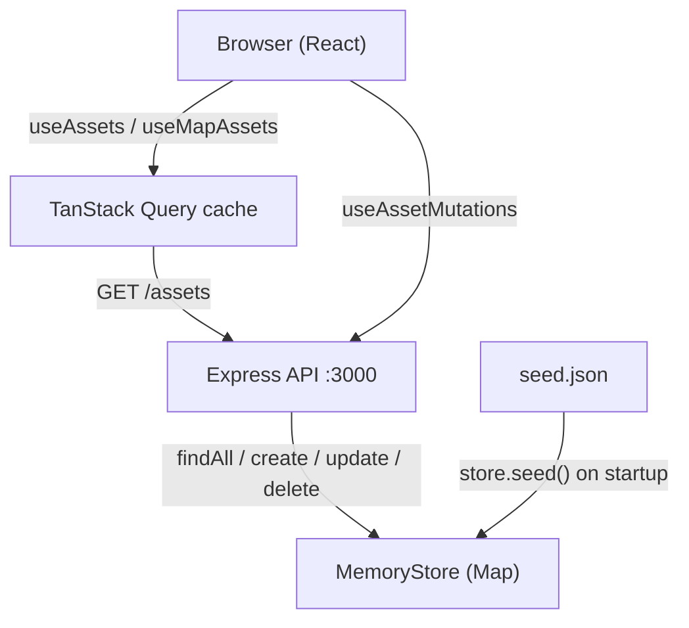
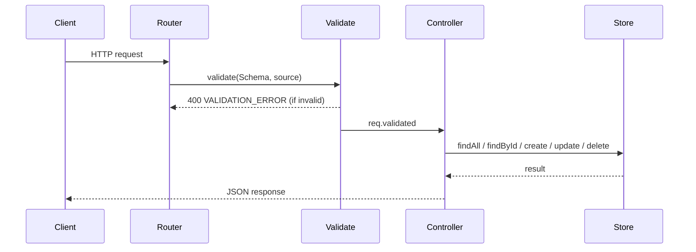

# Geo Asset Tracker

A small web app for tracking physical infrastructure assets on a map. Built using Node.js/Express (backend) and React (frontend), both in TypeScript.

## Quick start

**Requirements:** Node.js ≥ 20 and npm. With nvm: `nvm use 20` (or `nvm install 20`).

From the repo root:

```bash
npm run install:all   # install root, api, and client dependencies
npm run dev           # start API and frontend together
```

| Service      | URL                   | Notes                                             |
| ------------ | --------------------- | ------------------------------------------------- |
| **Frontend** | http://localhost:5173 | Open this in your browser                         |
| **API**      | http://localhost:3000 | JSON REST API; seeded from `seed.json` on startup |

`npm run dev` uses `concurrently` to run both servers. The API loads ~150 assets into an in-memory store on each start — data resets when you restart the server.

To run tests: `cd api && npm test`

## What it does

- **Map view** — all assets rendered as colour-coded circle markers (green = ok, amber = warning, red = critical). Clicking a marker opens the detail panel.
- **List view** — paginated table of assets, synced with the same filters and viewport as the map.
- **Filters** — toggle by asset type (pipe, hydrant, sensor, valve) and status (ok, warning, critical). Filters are OR-within-type, AND-across-types.
- **Viewport filter** — the list and map automatically narrow to the current map bounding box as you pan and zoom.
- **CRUD** — create, edit, and delete assets. Location is picked by clicking on an embedded mini-map inside the form.
- **~150 seed assets** loaded from `seed.json` on every server start.

## UI improvements

- **Animated zoom on selection** — clicking a marker flies the map to zoom level 13 via a smooth `flyTo` animation. Markers are hidden during the flight to avoid visual artifacts as they scale up.
- **Skip fly-to if already in view** — if the selected asset is already visible in the viewport at zoom ≥ 13, the map does not move. Avoids disorienting the user when the target is already on screen.
- **Reset Assets button** — when an asset is selected, a "Reset Assets" button appears in the asset list header. Clicking it clears the selection, resets pagination, and re-fits the map to the full dataset.
- **Viewport-synced list** — as the user pans or zooms, the asset list automatically narrows to assets within the current bounding box. The count label updates to reflect how many assets are visible out of the total.
- **List follows selection** — when a marker is clicked, the list scrolls to the selected item if it is on the current page, or navigates to the correct page automatically if it is not.

## Tech choices and why

| Concern           | Choice                              | Reason                                                                                          |
| ----------------- | ----------------------------------- | ----------------------------------------------------------------------------------------------- |
| Storage           | In-memory (`Map<string, Asset>`)    | Frees time for API and frontend quality; no Docker dependency for the developer                 |
| Geospatial filter | Bounding-box, computed in the store | Maps naturally to the Leaflet viewport; filter runs at the storage layer, not in the controller |
| Map library       | Leaflet + react-leaflet             | No API key, no billing, zero developer friction                                                 |
| Validation        | Zod schemas in `shared/`            | Single source of truth for both server middleware and client form validation via `zodResolver`  |
| Server state      | TanStack Query                      | Handles caching, invalidation, and loading states without a global store                        |
| Test runner       | Vitest + Supertest                  | Native ESM, fast, consistent with Vite on the frontend                                          |
| Pagination        | Offset-based (`page` + `limit`)     | Correct at this scale; `limit=500` for map queries, `limit=25` for the list                     |
| Edit verb         | `PATCH`                             | Partial update — only fields present in the body are changed                                    |

**Storage tradeoff:** data resets on every server restart. This is expected and documented. A migration to Postgres would swap `MemoryStore` for a `PostgresStore` that satisfies the same `AssetStore` interface — no controller or route changes required.

## Project structure

```
geo-asset-tracker/
├── api/                  # Express API (Node.js, TypeScript, ESM)
│   ├── src/
│   │   ├── server.ts     # Entry point — seeds store, starts listener
│   │   ├── app.ts        # Express app — CORS, routes, error handler
│   │   ├── controllers/  # Request handlers (read req.validated, call store)
│   │   ├── routes/       # Route definitions + validate() middleware wiring
│   │   ├── store/        # AssetStore interface + MemoryStore implementation
│   │   ├── middleware/   # validate() and errorHandler()
│   │   └── errors/       # AppError, NotFoundError, ValidationError
│   └── tests/
│       └── assets.test.ts
├── client/               # React SPA (Vite, TypeScript)
│   └── src/
│       ├── App.tsx        # Root — owns all shared state (filters, bbox, page, selection)
│       ├── components/
│       │   ├── AssetMap/  # MapContainer + CircleMarker per asset
│       │   ├── AssetList/ # Paginated list + AssetListItem
│       │   ├── AssetDetail/ # Detail panel (read, edit, delete)
│       │   ├── AssetForm/ # Create/edit form with LocationPicker mini-map
│       │   └── FilterBar/ # Type + status checkbox toggles
│       ├── hooks/
│       │   ├── useAssets.ts        # Paginated list query (limit=25)
│       │   ├── useMapAssets.ts     # Map marker query (limit=500)
│       │   ├── useAsset.ts         # Single asset, with cache fallback
│       │   └── useAssetMutations.ts # create / update / delete + invalidation
│       └── lib/
│           ├── api.ts      # Typed fetch wrappers for every endpoint
│           └── constants.ts # STATUS_COLORS map
└── shared/               # Imported by both api/ and client/
    ├── schemas.ts         # All Zod schemas
    └── types.ts           # Types inferred from schemas via z.infer<>
```

## Running locally

See **Quick start** above for install and run commands. Additional notes:

- No Docker required — everything runs with Node and npm.
- Changes to assets persist only until the API process is restarted.

## Running tests

```bash
cd api
npm test
```

Eight integration tests covering the paths that matter:

| #   | What it tests                                                                    |
| --- | -------------------------------------------------------------------------------- |
| 1   | Bbox filter — asset inside box is returned                                       |
| 2   | Bbox filter — asset outside box is excluded                                      |
| 3   | Antimeridian bbox — OR logic for boxes crossing ±180°                            |
| 4   | Filter composition — `type=pipe&status=warning` returns only matching assets     |
| 5   | POST validation — missing `lat` returns `400 VALIDATION_ERROR` with `fields.lat` |
| 6   | POST validation — `lat: 999` (out of range) returns `400` with `fields.lat`      |
| 7   | PATCH unknown id returns `404 NOT_FOUND`                                         |
| 8   | DELETE then GET proves deletion is durable within the session                    |

## API reference

Base URL: `http://localhost:3000`
All responses are `application/json`.

### Endpoints

| Method   | Path          | Description                                      |
| -------- | ------------- | ------------------------------------------------ |
| `GET`    | `/assets`     | List assets with optional filters and pagination |
| `GET`    | `/assets/:id` | Fetch a single asset                             |
| `POST`   | `/assets`     | Create an asset                                  |
| `PATCH`  | `/assets/:id` | Partially update an asset                        |
| `DELETE` | `/assets/:id` | Delete an asset                                  |

### `GET /assets` — query parameters

| Parameter | Type              | Default | Description                                            |
| --------- | ----------------- | ------- | ------------------------------------------------------ |
| `type`    | enum (repeatable) | —       | Filter by type. Multiple values are OR-ed.             |
| `status`  | enum (repeatable) | —       | Filter by status. Multiple values are OR-ed.           |
| `bbox`    | string            | —       | `minLng,minLat,maxLng,maxLat` in WGS84 decimal degrees |
| `page`    | integer ≥ 1       | `1`     | Page number (1-indexed)                                |
| `limit`   | integer 1–500     | `25`    | Results per page. Use `500` for map queries.           |

**Filter semantics:** same-parameter values combine with OR; different parameters combine with AND.

```
?type=pipe&type=valve&status=critical
→ (type = pipe OR type = valve) AND status = critical
```

### Response envelope

Every successful response wraps the payload in `data`. List responses add `meta`.

```json
{
  "data": [ ...assets ],
  "meta": { "total": 150, "page": 1, "limit": 25, "pages": 6 }
}
```

Every error uses the same shape:

```json
{
  "error": {
    "code": "NOT_FOUND",
    "message": "No asset with id 'abc-123' exists."
  }
}
```

Validation errors add a `fields` object with per-field messages.

### HTTP status codes

| Code | When                                         |
| ---- | -------------------------------------------- |
| 200  | Successful GET, PATCH                        |
| 201  | Successful POST (includes `Location` header) |
| 204  | Successful DELETE (no body)                  |
| 400  | Validation failure                           |
| 404  | Asset not found                              |
| 500  | Unexpected server error                      |

### Asset shape

```json
{
  "id": "17fc695a-07a0-4a6e-8822-e8f36c031199",
  "name": "Sensor S-0001",
  "type": "sensor",
  "status": "ok",
  "lat": 42.373366,
  "lng": -71.133174,
  "installed_at": "2001-04-05",
  "last_inspected_at": "2025-09-21",
  "notes": ""
}
```

| Field               | Type                                       | Notes            |
| ------------------- | ------------------------------------------ | ---------------- |
| `id`                | UUID v4                                    | Server-generated |
| `name`              | string                                     | Non-empty        |
| `type`              | `pipe` \| `hydrant` \| `sensor` \| `valve` |                  |
| `status`            | `ok` \| `warning` \| `critical`            |                  |
| `lat`               | number                                     | −90 to 90        |
| `lng`               | number                                     | −180 to 180      |
| `installed_at`      | `YYYY-MM-DD`                               |                  |
| `last_inspected_at` | `YYYY-MM-DD` or `null`                     |                  |
| `notes`             | string                                     | May be empty     |

## Geospatial filter

The bounding-box filter runs inside `MemoryStore.findAll()` — not in the controller, not in JavaScript after the fact. The store applies type → status → bbox filters in sequence, counts the total for `meta.total`, then paginates.

**Antimeridian handling:** when `minLng > maxLng` the box crosses ±180° longitude. The store uses OR logic for longitude in that case (`asset.lng >= minLng OR asset.lng <= maxLng`). The client normalises Leaflet's raw bounds before sending (`(((lng + 180) % 360) + 360) % 360 - 180`). The extra `+ 360) % 360` step is needed because JavaScript's `%` operator returns negative values for negative inputs.

**Migration path:** replacing `MemoryStore` with a Postgres implementation would move the bbox filter into a `WHERE` clause (or `ST_Within` with PostGIS). The `AssetStore` interface is the only contract the controller depends on — no other changes required.

## Architecture overview



**Request lifecycle:**



**State ownership in the frontend:**

`App.tsx` owns all shared state: `filters`, `bbox`, `page`, `selectedAssetId`, `showForm`, `editingAsset`. Components receive what they need as props and call callbacks to update it. TanStack Query owns all server state. No global store.

## Key design decisions

**Shared types.** `shared/schemas.ts` defines all Zod schemas. `shared/types.ts` derives all TypeScript types from them via `z.infer<>`. Both `api/` and `client/` import from `@shared/` — there is no duplicated `Asset` type.

**`app.ts` / `server.ts` split.** `app.ts` exports the Express app with no side effects. `server.ts` seeds the store and calls `app.listen()`. This lets Supertest import `app` directly without starting a real server.

**`PATCH` semantics.** `UpdateAssetSchema` is written as an independent `z.object()`, not `CreateAssetSchema.partial()`. Using `.partial()` would inherit the `.default(null)` on `last_inspected_at`, causing an absent PATCH field to be filled with `null` instead of left unchanged.

**`useAsset` cache fallback.** When a marker is clicked, `useAsset` checks the `mapAssets` query cache for the asset before issuing a network request. The detail panel appears instantly for assets already in the viewport.

**Two separate queries for map and list.** `useMapAssets` uses `limit=500` and no `page` parameter. `useAssets` uses `limit=25` and tracks `page`. They share the same endpoint but have separate TanStack Query keys so they cache and invalidate independently.

For the full decision log, see [architecture.md](./architecture.md).

## Known limitations

- **Data resets on restart** — the in-memory store is re-seeded from `seed.json` every time the API starts. Changes made during a session are lost on restart.
- **Map cap of 500 assets** — `useMapAssets` requests `limit=500`. Viewports containing more than 500 matching assets will not show all markers.
- **No authentication** — all endpoints are open.
- **Desktop-only layout** — the UI is not optimised for mobile viewports.

## What is explicitly out of scope

Per the assignment brief: authentication, mobile responsiveness, deployment, exhaustive test coverage, accessibility audits, production observability.
